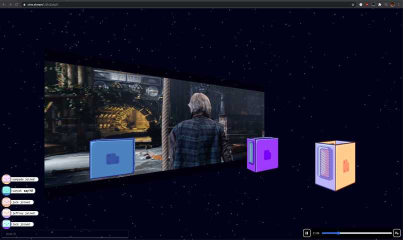

# [cine.stream](https://cine.stream) - A pure-css (no canvas) 3D watch party. 
No more "3...2...1...Start!"

## How we built it
The 3D space is pure CSS. This was intentional; we wanted to give ourselves the challenge of a pure-css 3D environment. The only canvas used is ParticlesJS for the background.

## Inspiration
At the beginning of lockdown, I remember sharing my screen to watch movies together with my friends. However, as time went on, I became increasingly frustrated at a couple of things: 

- The lack of quality. Most screen-sharing video platforms run on UDP, which prioritizes speed over accuracy. Unfortunately, watching movies of high quality requires both speed and accuracy. 
- The lack of 'closeness'. Most movie watch-together websites create spaces that are two-dimensional and aren't interactive, which feels somewhat robotic and somewhat gloomy. 
- Most movie sharing projects require the host to stream to every other participant, which bottlenecks really fast.

## What it does
We solve both issues by creating a movie-sharing *space*, where you can watch movies together in a virtual theater of sorts. Anyone can join the website and share the link to their room

We use direct MP4 links as a requirement to allow technically advanced users to set up their own content server to provide for the movies the group will be watching. For small groups, using localtunnel or some other HTTP tunneling program works just fine. 

## Challenges we ran into
Rotating the 'avatars' was embarrassingly difficult. About 5 hours were spent figuring out the math to make the avatars rotate in place (with lots of GeoGebra diagrams shared between us), but we ended up scrapping that idea for now, as the rotations looked unnatural. 

Additionally, looking up and down on the Y axis broke the perspective, so this was also a scrapped feature we worked on. The 'find public rooms' feature is also one we put on hold, as our main feature (a pure css 3D world) took a lot more effort than we envisioned. 

## Accomplishments that we're proud of
It works! It's very usable for what we need it for, which is watching mp4 videos together. The avatars are cute, and the chat works perfectly.
Even though the 3D world is not very complex, we are very proud of figuring out the math and logic behind making the room appear 3D without any canvases (it's only using CSS transforms!)

## What we learned
We started this not knowing a thing about CSS in 3D, and ended up doing a lot! Not everything was successful, but what we made was pretty cool. 

## What's next for cine.stream
There are a lot of small nuisances that we need to fix. Other than those, some large features we are planning includes: 
- youtube support
- webrtc/screesharing support
- installable desktop executable to create HTTP tunnels to share local mp4 files from behind a router
- find public rooms
